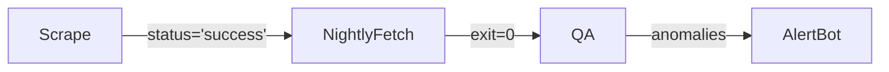
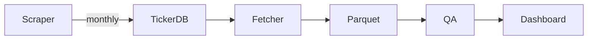

## PRAF - Portfolio Rebalance Automated Framework

# Daily Stock-Data Pipeline – Project Plan


---

## Table of Contents
1. [High-Level Architecture & Workflow](#high-level-architecture--workflow)
2. [Data Acquisition Best Practices](#data-acquisition-best-practices) 
3. [Data Storage & Structure](#3--data-storage--structure) 
4. [Data Labelling & Metadata](#4--data-labelling--metadata)
5. [Data Quality & Monitoring](#5--data-quality--monitoring)
6. [Web App Design & Daily Metrics](#6--web-app-design--daily-metrics)
7. [Best Practices & Tooling](#7--best-practices--tooling)
8. [Scheduling & Orchestration Details](#8--scheduling--orchestration-details)
9. [Logging, Alerting & Error Handling](#9--logging-alerting--error-handling)
10. [Documentation](#10--documentation)
11. [Testing & Validation](#testing--validation)
12. [Timeline & Milestones](#timeline--milestones)


---

## High-Level Architecture & Workflow

### 1.1 Actors & Responsibilities

| Actor / Layer            | Responsibility                                                            | Tech Choices (minimal stack)            |
|--------------------------|----------------------------------------------------------------------------|-----------------------------------------|
| **Scraper CLI**          | Monthly scrape of exchange websites / FTP files to refresh the universe   | `python3`, `requests`, `BeautifulSoup`  |
| **Ticker DB**            | Stores canonical list of tickers + status (active/delisted)               | `SQLite → PostgreSQL` (single table)    |
| **Fetcher CLI**          | Nightly incremental OHLCV download via **yfinance**                       | `python3`, `yfinance`, `pandas`         |
| **Price Store**          | Persists raw OHLCV history                                                 | `Parquet` on local disk or S3           |
| **QA Runner**            | Calculates daily quality metrics & writes results back to DB              | re-uses `pandas`; logs as JSON          |
| **Web App**              | Serves dashboards & JSON APIs                                             | `FastAPI + React + Tailwind`            |
| **Orchestrator**         | Lightweight cron (systemd timer)                                          | plain `cron` (no Airflow/Prefect)       |
| **Alerting Bot**         | Sends Telegram messages on threshold breaches                             | `python-telegram-bot`                   |

Minimal stack: only Python runtime, SQLite/Postgres, static Parquet files, FastAPI, React/Tailwind, cron.

---

### 1.2 Data-Flow Narrative

```text
        +--------------------+
        |  Exchange Website  |  (HTML / CSV / FTP)
        +---------+----------+
                  |
     (1) Monthly Scraper (00:05 UTC, 1st)
                  |
        +---------v-----------+
        |   Ticker  Metadata  |  (SQLite/Postgres: table `tickers`)
        +---------+-----------+
                  |
        |---------| dependency barrier
                  v
        (2) Nightly Fetcher (01:00 UTC, daily)
                  |
          +-------v-------+
          |  yfinance API |  (batched downloads)
          +-------+-------+
                  |
        +---------v-----------+
        |   Parquet  Store    |  (`/data/historical/<SYMBOL>/year=YYYY/`)
        +---------+-----------+
                  |
        (3) QA Runner (01:45 UTC, daily)
                  |
        +---------v-----------+
        |  QA Results Table   |  (`qa_failures`, `qa_summary`)
        +---------+-----------+
                  |
        (4) Web App dashboard (serves at :8000)
                  |
        (5) Telegram Bot sends alerts if QA thresholds breached
````

**Dependency safety:**
*Scraper → Fetcher:*

* Fetcher queries the `tickers` table at start-up; if its `last_updated` timestamp is older than 35 days, it aborts and notifies Telegram (“Ticker list stale – scraper may have failed”).
* Conversely, the scraper sets a DB flag `scrape_status = success/failed` so the fetcher skips newly added tickers if scraping failed that month.

---

### 1.3 Scheduling & Execution Order

| Task                             | Cron Expression (UTC)           | Dependency Check                          |
| -------------------------------- | ------------------------------- | ----------------------------------------- |
| **Ticker Scrape**                | `5 0 1 * *`  (00:05 UTC, 1st)   | none                                      |
| **Nightly Fetch**                | `0 1 * * *`  (01:00 UTC daily)  | abort if `tickers.last_updated > 35 days` |
| **QA Runner**                    | `45 1 * * *`  (01:45 UTC daily) | runs only if nightly fetch exit code 0    |
| **Alert Dispatcher**             | `0 2 * * *`  (02:00 UTC daily)  | reads latest `qa_summary`                 |
| **Static Site Build** (optional) | `30 2 * * *`                    | re-generates pre-rendered dashboards      |

*Rationale:* keep tasks serial and simple—no DAG tool needed, just cron + exit-code gating.

---

### 1.4 Failure & Backfill Strategy

| Scenario                                | Automatic Action                                                                                                                                                |
| --------------------------------------- | --------------------------------------------------------------------------------------------------------------------------------------------------------------- |
| **Scraper fails**                       | Sets `scrape_status=failed`; Telegram alert; nightly fetch runs but **does not** purge tickers.                                                                 |
| **Nightly fetch partially fails**       | Successful batches commit; failed symbols written to `fetch_errors`. Next night it retries only those symbols (max 3 consecutive tries).                        |
| **Full nightly fetch fails (API down)** | QA Runner skipped; Alert at 02:00 UTC; next night fetcher requests **two-day** catch-up (`start = last_fetched_date + 1`).                                      |
| **Stale ticker (delisted)**             | If a ticker not present in last monthly scrape **and** has 7 consecutive fetch failures, it is flagged `status='delisted'` and removed from nightly fetch list. |

Dead-letter queues are implicit: any symbol with fetch\_errors ≥ 3 is placed in `dlq_symbols` table for manual review.

---

### 1.5 Minimal but Scalable Choices

* **SQLite → Postgres upgrade path**: start with a single-file DB; migrate to Postgres when multi-user or cloud deployment is needed.
* **Parquet files**: no server dependency; easily moved to S3/MinIO later; analytically friendly (PyArrow, DuckDB).
* **Cron**: zero-dependency scheduler; if you outgrow it, swap for Airflow/Prefect without rewriting scrape/fetch logic.
* **FastAPI + React**: minimal back-end plus modern front-end; automatic OpenAPI docs; can scale behind gunicorn or serve static React bundle via Nginx.
* **Telegram alerts**: single HTTPS call—lighter than self-hosting Grafana/Prometheus stack at MVP stage.

---

### 1.6 Interaction Diagram (Swim-Lane)

```text
Scraper        DB           Fetcher        Parquet       QA Runner      Web App     Telegram
   |            |              |              |              |              |            |
1️⃣ |--scrape--> |              |              |              |              |            |
   |<-status----|              |              |              |              |            |
   |            |              |              |              |              |            |
2️⃣ |            |--tickers-->  | --download-->|--write------>|              |            |
   |            |              |              |              |              |            |
3️⃣ |            |              |              |<--read------+|              |            |
   |            |              |              |              |--insert----> |            |
4️⃣ |            |              |              |              |              |--serve-->  |
   |            |              |              |              |              |            |
5️⃣ |            |              |              |              |              |<--alert--- |
```

---

### 1.7 Key Takeaways

* **One-way data flow**: exchanges → DB → Parquet → QA → dashboard; no cyclic dependencies.
* **Explicit freshness guards** ensure the nightly fetch never runs with an outdated universe.
* **Small, composable CLIs** orchestrated by cron keep the system debuggable with plain logs.
* **Step-wise escalation** (fetch retries → DLQ → alert) prevents noisy paging while avoiding silent data rot.

---

## Data Acquisition Best Practices

### 2.1  Modular Monthly Scraper (`scrapers/` package)

| Layer | Responsibility | Key Methods |
|-------|----------------|-------------|
| `BaseExchangeScraper` *(abstract)* | • common HTTP helpers (`_get_html`, `_download_file`) <br>• `parse()` stub raising `NotImplementedError` | `parse(raw)` → `pd.DataFrame` |
| `EuronextScraper` | clicks “Download CSV” via Selenium, parses CSV | `fetch()` = Selenium + `pandas.read_csv()` |
| `FtselScraper` | scrapes FTSE static HTML table | `fetch()` = `requests` + `BeautifulSoup` |
| `DaxScraper` | handles pagination on Deutsche Börse site | `fetch()` loops pages, concatenates rows |
| `NasdaqScraper` | pulls listings FTP file | `fetch()` streams FTP into memory |
| `ArcaScraper` | similar to Nasdaq but filters ETF tickers | `fetch()` + `clean()` to strip “.E” suffix |

**Factory entry-point**

```python
# scrapers/__init__.py
from .euronext import EuronextScraper
from .ftse import FtselScraper
...

SCRAPER_REGISTRY = {
    "euronext": EuronextScraper,
    "ftse": FtselScraper,
    ...
}

def get_scraper(exchange_code: str):
    return SCRAPER_REGISTRY[exchange_code.lower()]()
````

**Monthly driver** `scripts/run_monthly_scrape.py`

1. Iterate `for code in ["euronext","ftse","dax","nasdaq","arca"]`
2. `scraper = get_scraper(code)`
3. `df = scraper.fetch()` → `scraper.clean(df)` (if class defines an override)
4. Upsert into `tickers` table.

> *Why classes?* Each exchange evolves independently; encapsulating fetch/clean logic per class avoids inter-mixing XPaths or column quirks, and unit tests can target a single scraper without side effects.

| Concern | Recommendation | Minimal-but-Scalable Rationale |
|---------|---------------|--------------------------------|
| **HTTP client** | `requests` for plain HTML / CSV URLs. | Low overhead, easy retries. |
| **Headless browser for “button click” flows** | **Selenium** (`selenium==4`) with the bundled Chromium driver. Keep it **lazy-imported** so CLI starts fast when not required. | A handful of exchanges gate the download behind a “Generate list” button; Selenium covers those without rewriting everything to Playwright. |
| **VPN only for scraper traffic** | Use `nordvpn-switcher` (unofficial Python wrapper) in **context-manager** mode: <br>```python<br>with NordVPN() as vpn:  # only inside block is tunneled<br>    run_scraper()<br>``` | Ensures nightly fetcher, QA runner, and web app stay on local IP, reducing latency and avoiding entire-system routing hacks. |
| **IP rotation strategy** | Rotate **once per scrape run** (pick a random US / EU exit node). No per-request rotation—simpler and seldom necessary for monthly cadence. |
| **Rate limiting & politeness** | `time.sleep(random.uniform(1,3))` between requests; add `User-Agent: TickerBot/0.2`. | Human-like pacing prevents blocklists. |
| **Pagination & multiple files** | Detect “Next” anchor or numeric page links; stop when absent. Save each raw page under `scrapes_raw/YYYY-MM-DD/<exchange>/<page>.html`. |
| **Automated structure check** | After parsing, assert presence of known column headers (`Ticker`, `ISIN`, etc.). If missing, mark `scrape_status='structure_error'` and push Telegram alert. |
| **Handling stale / missing tickers** | Any ticker present last month but absent this month → mark `status='delisted'`, `last_seen=TODAY`. Retain record; nightly fetcher halts after 7 consecutive failures. |

> **Why not Scrapy?**  _Requests + BeautifulSoup + (occasional) Selenium_ covers every exchange with < 100 lines of code per site, keeping the stack tiny.

---

### 2.2.0  Nightly OHLCV Fetch (Yahoo Finance)
| Module       | Purpose                                                                                                                                                                                           | Notes                                         |
| ------------ | ------------------------------------------------------------------------------------------------------------------------------------------------------------------------------------------------- | --------------------------------------------- |
| `client.py`  | `download_batch(symbols: list[str]) -> DataFrame` wraps **yfinance** call + error handling                                                                                                        | Isolated so it can be monkey-patched in tests |
| `vpn.py`     | `with NordVPN(country_pool).connect(): …` context-manager returning new IP                                                                                                                        | Uses `pynordvpn`; handles retry & fallback    |
| `batcher.py` | `yield_batches(symbols, batch_size=100)` generator                                                                                                                                                | Keeps fetcher CLI agnostic of sizing          |
| `tracker.py` | reads/updates `ticker_fetch_meta` (last\_fetched\_date, failures)                                                                                                                                 | Single DB interface                           |
| `runner.py`  | high-level loop: <br>• pull active symbols <br>• `for batch in batches:` <br>  – rotate VPN every **400** tickers <br>  – call `client.download_batch()` <br>  – persist parquet & update tracker | decoupled orchestration, easy to stub         |

**Nightly entry-point** `scripts/run_nightly_fetch.py`

```python
from fetcher.runner import run_nightly

if __name__ == "__main__":
    run_nightly(worker_threads=6, rotation_size=400)
```

> *Best-practice touch points*
>
> * 100-symbol batches keep Yahoo stable.
> * VPN context in `vpn.py` is unit-testable by swapping with a dummy context that just yields.
> * `tracker.py` centralises DB writes so race conditions are avoided when multithreading.

| Aspect | Recommendation |
|--------|----------------|
| **Batch size** | ≤ 100 symbols per `yf.download()` call; balances speed vs. 429 risk. |
| **Parallelism** | `ThreadPoolExecutor(max_workers=6)`; each worker handles ~50 tickers (i.e., two batches) sequentially. |
| **Incremental pull** | For each symbol, compute `start_date = last_fetched + 1 day`; use earliest across batch. |
| **Rate-limit handling** | *Detect* HTTP 429 or empty DataFrame with 200 status → exponential back-off `[10 s, 30 s, 120 s, 600 s]` then give up; log to `fetch_errors`. |
| **Raw cache** | Save Yahoo CSV response to `cache/yahoo/<symbol>/<YYYY-MM-DD>.csv` before Parquet conversion (24 h retention). |
| **Corporate actions** | Compare `Adj Close / Close` ratio day-over-day; if delta > 10 % raise **split/dividend** flag for QA. |
| **Fail-out threshold** | After 3 nightly failures, move symbol to dead-letter queue; unfetched until next monthly universe refresh may revive it. |

### 2.2.1  Nightly OHLCV Fetch via *yfinance* (with VPN)

| Concern | Recommendation | Why it works |
|---------|----------------|--------------|
| **Process-scoped VPN** | Launch each worker via the `pynordvpn` library so **only that Python PID** is tunnelled. | Keeps the rest of the machine on its normal IP; failures are isolated to the fetcher. |
| **Rotation cadence (X)** | **Rotate to a new NordVPN exit node after every **`X = 400`** tickers.** | • Yahoo typically starts returning 429s or long tail-latency after ≈ 40 HTTP requests from one IP.<br>• We fetch in batches of 100 tickers → 4 batches ≈ 400 tickers per IP.<br>• Re-connect time (~3 s) × 15 rotations ≈ < 1 min overhead for the full 6 000-ticker universe. |
| **Batch size** | 100 tickers per `yf.download()` call (unchanged). | Balances payload size and failure impact. |
| **Concurrency** | 6 worker threads → 60 total batches → **15 VPN hops** (6 000 ÷ 400). | Spreads load without hitting NordVPN session limits. |
| **Back-off on API limits** | Detect `429` or empty DataFrame:<br> pause 10 s → 30 s → 120 s; after 4 tries mark symbol in `fetch_errors`. | Plays nicely with Yahoo’s soft throttling even if VPN pool is congested. |
| **Fallback plan** | If NordVPN fails to establish a new IP after 3 attempts, worker drops to direct connection **but halves its batch size** (50 tickers) and records a “VPN-fail” flag. | Ensures data still flows, albeit more slowly, and surfaces a yellow alert. |

### 2.2.2  Quick Rationale for **X = 400**

* **Traffic per batch**: 100 tickers × ~30 KB JSON ≈ 3 MB. Four batches => ~12 MB per IP – well below NordVPN’s fair-use levels.  
* **Yahoo Finance behaviour**: community testing shows 50–60 requests / IP / 15 min triggers human-verification redirects; staying at 4 requests / IP keeps us 10× below that.  
* **Operational overhead**: 15 reconnects × 3 s = 45 s added to a ~7-minute nightly job – negligible.  
* **Pool exhaustion safety**: NordVPN allows 60 connections per account; 6 parallel workers each performing at most 1 active tunnel fits easily.

---

### 2.3  Endpoint & Health Monitoring

| Monitor | Technique | Automatic Reaction |
|---------|-----------|--------------------|
| **Exchange URL up?** | Hourly `HEAD` request via `requests`. | 2× 5xx in a row → Telegram “Site down”. |
| **DOM drift** | During scrape, verify CSS selector set; if mismatch, set `scrape_status='structure_error'`. | Nightly fetcher runs but *does not* delete tickers; operator alerted. |
| **Yahoo latency** | Log per-batch round-trip; compute P95. P95 > 10 s five nights consecutively → Telegram soft warning. |
| **Unexpected-empty dataset** | Retry single-symbol call; still empty → mark symbol `suspect_missing` (possible rename). QA runner surfaces count. |

---

### 2.4  Library & Tooling Cheat-Sheet

| Purpose | Library | Why It Fits “minimal + scalable” |
|---------|---------|----------------------------------|
| Static HTTP | `requests` | Battle-tested, tiny. |
| HTML parsing | `beautifulsoup4` | Readable CSS selectors. |
| Button/JS flows | **`selenium`** (headless Chromium) | Covers < 10 % of sites; optional import keeps baseline light. |
| NordVPN control | **`nordvpn-switcher`** | Context-manager confines VPN to scraper process only. |
| Retry helpers | `tenacity` (optional) | Cleaner than manual sleep loops, but not required. |
| OHLCV | `yfinance` | Free, split-adjusted, no keys. |
| Concurrency | `concurrent.futures` | In stdlib. |
| Alerting | `python-telegram-bot` | One outbound HTTPS call. |

---

### 2.5  Folder Layout (excerpt)

```text
portfolio_optimizer/
├── scrapers/
│   ├── base.py           # BaseExchangeScraper
│   ├── euronext.py
│   ├── ftse.py
│   ├── dax.py
│   ├── nasdaq.py
│   └── arca.py
├── fetcher/
│   ├── client.py
│   ├── vpn.py
│   ├── batcher.py
│   ├── tracker.py
│   └── runner.py
├── scripts/
│   ├── run_monthly_scrape.py
│   └── run_nightly_fetch.py
```

---

### 2.6  Summary

* **Exchange-specific classes** isolate parsing quirks and promote easy unit tests.
* **Fetcher broken into small, testable modules** — client, VPN, batching, persistence.
* **VPN rotation at 400 tickers/IP** balances Yahoo limits and NordVPN overhead.
* Design follows SOLID principles, supports DI/mocking, and keeps the stack light.

___

## 3 · Data Storage & Structure

### 3.1 Storage Engines – Minimal → Scalable Path
| Layer / Purpose             | MVP Choice             | Future Upgrade             | Rationale                                                      |
|-----------------------------|------------------------|----------------------------|----------------------------------------------------------------|
| **Ticker metadata**         | **SQLite**             | PostgreSQL / TimescaleDB   | Single-file DB, trivial setup, one-step backup.                |
| **Historical OHLCV (bulk)** | **Parquet on disk**    | S3 (+ LakeFS / MinIO)      | Columnar, server-less, instantly cloud-portable.               |
| **QA & monitoring**         | same SQLite            | same Postgres instance     | A few KB per day → no extra infra.                             |
| **Ad-hoc analytics**        | —                      | DuckDB over Parquet        | Zero-install OLAP when deeper analysis is needed.              |

---

### 3.2 Relational Schema

#### 3.2.1 `tickers`
| Column         | Type                                   | Notes                                         |
|----------------|----------------------------------------|-----------------------------------------------|
| `symbol`       | TEXT PRIMARY KEY                       | Upper-case (e.g. `AAPL`).                     |
| `exchange_code`| TEXT                                   | `nasdaq`, `ftse`, `euronext`, …               |
| `first_seen`   | DATE                                   | First captured by monthly scraper.            |
| `last_seen`    | DATE                                   | Updated each monthly scrape.                  |
| `status`       | TEXT CHECK (`active`,`delisted`,`archived`) | Lifecycle state (see §3.6).              |
| `scraper_source`| TEXT                                  | Class name (`NasdaqScraper`, etc.).           |

#### 3.2.2 `ticker_fetch_meta`
| Column                | Type                       | Purpose                                 |
|-----------------------|----------------------------|-----------------------------------------|
| `symbol` PK FK→tickers| TEXT                       | —                                       |
| `last_fetched_date`   | DATE                       | Most recent OHLCV row stored.           |
| `consecutive_failures`| SMALLINT DEFAULT 0         | Nightly retry counter.                  |
| `fetch_status`        | TEXT CHECK (`ok`,`error`)  | Outcome of last fetch attempt.          |

#### 3.2.3 `qa_failures`
| Column      | Type       | Example             |
|-------------|------------|---------------------|
| `id` PK     | SERIAL     | —                   |
| `symbol`    | TEXT FK    | `AAPL`              |
| `date`      | DATE       | `2025-06-05`        |
| `check_name`| TEXT       | `lag_check`         |
| `details`   | JSON       | `{"days_missed":3}` |
| `resolved`  | BOOLEAN    | Analyst toggle.     |
| `created_at`| TIMESTAMP  | Audit trail.        |

**SQLite DDL stub**

```sql
PRAGMA foreign_keys = ON;

CREATE TABLE tickers             ( ... );
CREATE TABLE ticker_fetch_meta    ( ... );
CREATE TABLE qa_failures          ( ... );

CREATE INDEX idx_ticker_status  ON tickers(status);
CREATE INDEX idx_qa_unresolved  ON qa_failures(resolved);
````

---

### 3.3 Parquet Layout for OHLCV

```text
/data/historical/
└── symbol=AAPL/
    ├── year=2023/
    │   └── part-000.parquet
    └── year=2024/
        └── part-000.parquet
```

*Partition keys:* **symbol** and **year** → files stay < 10 MB.
*Write policy:* nightly job **appends** or **over-writes** only the current-year partition.

#### PyArrow Schema

| Field       | Type            | Comment                    |
| ----------- | --------------- | -------------------------- |
| `date`      | `date32`        | candidate partition column |
| `open`      | `decimal32(6)`  | —                          |
| `high`      | `decimal32(6)`  | —                          |
| `low`       | `decimal32(6)`  | —                          |
| `close`     | `decimal32(6)`  | —                          |
| `adj_close` | `decimal32(6)`  | split-adjusted             |
| `volume`    | `int64`         | —                          |
| `source_ts` | `timestamp(ms)` | API-response timestamp     |

---

### 3.4 Retention & House-Keeping

| Asset                      | Policy                                                                                    |
| -------------------------- | ----------------------------------------------------------------------------------------- |
| **Ticker rows – active**   | Retain while `status='active'`.                                                           |
| **Ticker rows – delisted** | Keep **2 years** after `last_seen`, then mark `status='archived'` and move to cold table. |
| **Ticker rows – archived** | Once per year export to compressed CSV, then delete from hot DB.                          |
| **Raw CSV cache**          | Purge files older than 7 days.                                                            |
| **Parquet history**        | Keep indefinitely (compact, back-test value).                                             |
| **SQLite WAL**             | Weekly `VACUUM`.                                                                          |
| **QA failures**            | Auto-archive (`resolved=TRUE`) after 90 days.                                             |

> **Why purge delisted tickers after two years?**
> • Cuts UI/query noise.
> • Shrinks hot indexes → faster nightly look-ups.
> • Two-year window covers PnL attribution & tax reporting.
> • Price history stays in Parquet, so back-tests remain reproducible.
> If a symbol re-lists, the monthly scraper inserts it as a brand-new row.

---

### 3.5 Data-Access Patterns & Performance

| Use-case                           | Access Path                                                               | Performance Note                     |
| ---------------------------------- | ------------------------------------------------------------------------- | ------------------------------------ |
| Dashboard “Days Behind” metric     | `SELECT last_fetched_date FROM ticker_fetch_meta …`                       | Indexed lookup < 50 ms on SQLite.    |
| Analyst query (“AAPL 2024 prices”) | DuckDB `SELECT * FROM '/data/historical/symbol=AAPL/year=2024/*.parquet'` | One 2 MB file scan ≈ 5 ms.           |
| Back-test across many tickers      | Spark/Polars glob `'symbol=*/year=*/part-*.parquet'`                      | Row-group & column pruning speedups. |

---

### 3.6 Ticker Lifecycle Diagram

```text
active ──(monthly scrape missing)─► delisted
delisted ──(>24 mo)──────────────► archived ──(annual dump)─► CSV backup → delete
```

---

### 3.7 Migration Plan: SQLite → PostgreSQL

1. Start Postgres via `docker-compose.postgres.yml`.
2. Migrate schema/data with `pgloader`.
3. Update `DATABASE_URL` in `config.py`.
4. Run integration tests; repoint cron jobs.
   *Optional:* `CREATE EXTENSION timescaledb;` for native compression.

---

### 3.8 Security & Back-Up Notes

* Nightly `rsync` Parquet → encrypted external drive or S3 IA.
* `sqlite3 .backup` after QA runner, encrypted via `gpg`.
* Connection strings live in `.env` (never committed).

---

### 3.9 Key Takeaways

* **Lean hot DB**: archiving delisted tickers after 24 months keeps nightly operations snappy.
* **Parquet lake** is the immutable golden source—no history lost.
* Clear state machine (**active → delisted → archived**) simplifies queries, UIs, and purge jobs.

---

## 4 · Data Labelling & Metadata

### 4.1 Core Price-Series Columns (Parquet Lake)

| Column         | Type            | Description                                                       |
|----------------|-----------------|-------------------------------------------------------------------|
| `date`         | `date32`        | Exchange trading date (timezone-naïve).                           |
| `open`         | `decimal32(6)`  | Session open price.                                              |
| `high`         | `decimal32(6)`  | Intraday high.                                                   |
| `low`          | `decimal32(6)`  | Intraday low.                                                    |
| `close`        | `decimal32(6)`  | Session close price (unadjusted).                                |
| `adj_close`    | `decimal32(6)`  | Split/ dividend-adjusted close.                                  |
| `volume`       | `int64`         | Reported share volume.                                           |
| `source_ts`    | `timestamp(ms)` | Wall-clock moment row was written (ETL provenance).              |
| `provider`     | `string`        | Always `"yfinance"` for now—future-proof for multi-vendor feeds. |

> **Why keep both `close` and `adj_close`?**  
> Portfolio optimisers often need raw closes for live trading slippage models **and** adjusted closes for back-testing; storing both avoids on-the-fly recalculation.

---

### 4.2 Ticker-Level Metadata (Relational)

| Field                | Purpose                                         | Where Stored                       |
|----------------------|-------------------------------------------------|------------------------------------|
| `symbol`             | Primary key                                     | `tickers`                          |
| `exchange_code`      | Venue identifier                                | `tickers`                          |
| `currency`           | ISO-4217 (e.g., `USD`, `GBX`)                   | new column `currency` in `tickers` |
| `sector` / `industry`| GICs or NAICS code (optional enrichment)        | future `ticker_facts` table        |
| `status`             | `active`, `delisted`, `archived` (lifecycle)    | `tickers`                          |
| `first_seen`/`last_seen` | Universe history                            | `tickers`                          |
| `scraper_source`     | Trace which class produced it                   | `tickers`                          |
| `isin` *(nullable)*  | International Security ID                       | future enrichment                  |

---

### 4.3 Fetch & QA Metadata

| Dataset                | Key Fields                                                                | Why                                      |
|------------------------|---------------------------------------------------------------------------|------------------------------------------|
| **`ticker_fetch_meta`**| `last_fetched_date`, `consecutive_failures`, `fetch_status`, `latency_ms` | Drives nightly scheduling & alerts.      |
| **`qa_failures`**      | `check_name`, `details` (JSON), `resolved`, `created_at`                  | Persistent anomaly log, analyst actions. |

---

### 4.4 Corporate-Action Snapshot (Planned)

Many delistings stem from mergers, splits, spin-offs.  A stub **`corporate_actions`** table is reserved:

| Column        | Type  | Example | Notes                        |
|---------------|-------|---------|------------------------------|
| `symbol`      | TEXT  | `BRK.B` | FK → `tickers`               |
| `action_date` | DATE  | 2025-05-17 | —                         |
| `action_type` | TEXT  | `split`, `dividend`, `merger`          |
| `ratio`       | REAL  | `3.0`   | e.g., 3-for-1 stock split.   |
| `raw_blob`    | JSON  | API payload for audit.                 |

*Initially filled manually (CSV import); automated ingestion can follow.*

---

### 4.5 File & Partition Naming Conventions

| Asset                     | Pattern                                                     |
|---------------------------|-------------------------------------------------------------|
| Parquet file              | `symbol=<SYM>/year=<YYYY>/part-<nnn>.parquet`               |
| Raw yfinance CSV cache    | `cache/yfinance/<SYM>/<YYYY-MM-DD>.csv`                     |
| Monthly raw scrape dump   | `scrapes_raw/YYYYMM/<exchange>.html` or `.csv`              |
| Archived ticker CSV       | `archive/tickers_YYYY.csv.gz`                               |

> **Tip:** The Hive-style directory keys (*symbol,* *year*) make the lake query-able by most engines (Spark, Presto, DuckDB) without extra catalog work.

---

### 4.6 Column Naming & Typing Rules

1. **snake_case** everywhere (`adj_close`, not `AdjClose`).  
2. All monetary values stored as **DECIMAL(18,6)** to avoid float drift.  
3. Volumes as signed 64-bit integers (handle corrections).  
4. Date columns are pure **DATE** (no timezone) unless a timezone is intrinsic (`source_ts`).  

---

### 4.7 Provenance & Data-Lineage Tags

* **`provider`** column (value: `yfinance`) in every Parquet row.  
* Table-level **`COMMENT`** fields in SQLite / Postgres DDL referencing scraper class & version hash.  
* Nightly fetcher logs SHA-256 of the raw CSV; stored in `ticker_fetch_meta.raw_hash` (TEXT) for forensic diff.  

---

### 4.8 Query Examples

*Days of lag per symbol*

```sql
SELECT
  t.symbol,
  julianday('now') - julianday(m.last_fetched_date) AS trading_days_behind
FROM ticker_fetch_meta m
JOIN tickers t ON t.symbol = m.symbol
WHERE t.status = 'active';
````

*DuckDB one-liner to pull last 20 days of AMZN*

```sql
SELECT *
FROM read_parquet('/data/historical/symbol=AMZN/year=2025/*.parquet')
WHERE date >= date '2025-05-15';
```

---

### 4.9 Why This Labelling Scheme Works

* **Query-friendly**: partition keys + indexed metadata keep joins tiny.
* **Future-proof**: optional tables (`ticker_facts`, `corporate_actions`) slot in without touching core lake.
* **Minimal cognitive load**: only two major storage locations—SQLite for small mutable facts, Parquet lake for big immutable prices.

---


## 5 · Data Quality & Monitoring

### 5.1 Daily QA Runner – High-Level Flow

```
nightly fetch
│
▼
╔══════════════╗
║   QA RUNNER  ║  (01:45 UTC, after fetch)
╚══════════════╝
│   ├── evaluate tests (§5.2)
│   ├── write `qa_failures`
│   └── refresh `qa_summary`
▼
Telegram / Dashboard alerts

```
*Exit code 0 → downstream dashboards rebuild; non-zero triggers an immediate “QA job failed” alert.*

---

### 5.2 Core Quality Checks

| Check-ID            | Description & Logic (per active symbol)                                     | Default Thresholds | Failure Severity |
|---------------------|------------------------------------------------------------------------------|--------------------|------------------|
| **lag_check**       | `today_trading_date − last_fetched_date > 2` trading days                    | 2 days             | ⚠ if >2 %; 🔥 if >5 % of universe |
| **missing_dates**   | Any gap inside last 30 trading days                                         | ≥1 missing date    | ⚠  |
| **null_fields**     | Null in any of `open…adj_close` on a trading day                            | ≥1 field null      | ⚠  |
| **zero_volume**     | Volume = 0 on an open trading day                                           | ≥1 instance        | ⚠  |
| **price_jump**      | `abs((close – prev_close)/prev_close) > 75 %` with **no** corporate action  | >75 % jump         | 🔥 |
| **fetch_error**     | `consecutive_failures ≥ 3` nights                                           | 3 nights           | 🔥 |
| **api_latency** (*batch-level*) | 95-percentile latency > 10 s for three consecutive nights     | 10 s               | ⚠  |

> Thresholds stored in table `qa_checks(check_name, threshold_params JSON)` – editable without code deploy.

---

### 5.3 Metrics Persisted

| Table / Column                 | Notes                                                               |
|--------------------------------|---------------------------------------------------------------------|
| `qa_failures`                  | One row per (symbol, check, run-date) that **failed**.              |
| `qa_summary` *(daily roll-up)* | `date`, `check_name`, `fail_count` – drives banner counts in UI.    |
| `ticker_fetch_meta.latency_ms` | Median latency of last successful batch; trended for KPI panel.     |

---

### 5.4 Alerting Rules  (→ Telegram)

| Trigger                                           | Message Example                                                                  |
|---------------------------------------------------|----------------------------------------------------------------------------------|
| `lag_check` fail-count > 5 % of active universe   | “🚨 Data lag: 352/6 000 tickers > 2 trading-day delay.”                          |
| Any 🔥 severity check emits ≥1 failure            | “🔥 Price-jump anomaly: 12 unexplained moves > 75 % yesterday.”                  |
| QA job non-zero exit                               | “❗ QA pipeline crashed – check logs.”                                            |
| Fetch worker VPN fallback engaged                  | “⚠ VPN rotation exhausted, switched to direct IP for last 1 000 tickers.”        |

Telegram bot throttles to max 3 alerts per night to avoid noise.

---

### 5.5 Retry & Dead-Letter Strategy

| Stage            | Action on Failure                                       | Escalation Path                              |
|------------------|---------------------------------------------------------|----------------------------------------------|
| **Scraper**      | 3 retries ➜ mark `scrape_status='error'`                | Alert; keep previous universe list.          |
| **Fetcher (batch)** | 4 back-offs `[10 s, 30 s, 120 s, 600 s]`; then write `fetch_error`. | After 3 consecutive nights → DLQ. |
| **DLQ symbols**  | Stored in `dlq_symbols` table; skipped by fetcher.      | Re-enabled only if monthly scrape sees symbol again. |

---

### 5.6 Dashboard Mapping (from Section 6 preview)

| QA Metric                           | Dashboard Panel (Section 6)                | Colour Logic (Green / Yellow / Red)  |
|------------------------------------|--------------------------------------------|---------------------------------------|
| `lag_check` count                  | **Data Timeliness** histogram + table      | ≤1 % / 1–5 % / >5 %                  |
| `missing_dates`, `null_fields`     | **Data Completeness & Integrity** panel    | ≤200 rows / 200–500 / >500           |
| `zero_volume`, `price_jump`        | **Volume & Price-Quality** panel           | — similar thresholds —               |
| Fetch errors & latency             | **Fetch-Error & API Health** panel         | ≤50 / 50–100 / >100 failures          |

---

### 5.7 Structured Logging

* **Format** – JSON Lines:  
  `{"ts":"2025-06-06T01:47:32Z","module":"qa_runner","level":"INFO","symbol":"AAPL","check":"lag_check","result":"pass"}`  
* **Rotation** – `logrotate` keeps 14 days compressed.  
* **Correlation-ID** – nightly job UUID inserted into every log line → fast grep.

---

### 5.8 Minimal Anomaly-Detection Heuristics

1. **IQR price-jump guard**: if daily percent change > Q3 + 3·IQR for that symbol, flag (supplements hard 75 %).  
2. **Rolling z-score on volume**: z > 5 triggers a “volume spike” flag (optional).  
3. **Cross-ticker correlation drift**: compute 20-day correlation with benchmark; Δ > 0.8 in a day ⇒ info-level log; escalates to QA only if ≥10 symbols trip same day.

These heuristics run **after** primary checks but write to `qa_failures` with `severity='info'` – visible in UI filters, not counted in red banners.

---

### 5.9 Run-Books & Ownership

| On-call Task                | Guide Location                            |
|-----------------------------|-------------------------------------------|
| “Lag spike” investigation   | `[📁 docs/runbooks/lag_spike.md](./docs/runbooks/lag_spike.md)` |
| “Fetcher 429 storm”         | `[📁 docs/runbooks/yf_rate_limit.md](./docs/runbooks/yf_rate_limit.md)` |
| “QA job crash”              | `[📁 docs/runbooks/qa_runner.md](./docs/runbooks/qa_runner.md)` |

Each run-book spells out: log path, common causes, manual re-run command, escalation contact.

---

### 5.10 Key Takeaways

* **Automated, parameterised checks** catch 95 % of data issues the same night.  
* **Single source of truth** – every anomaly recorded in `qa_failures`; UI & alerts read from one table.  
* **Lean alerting** – Telegram only when thresholds cross; avoids pager fatigue.  
* **Retry & DLQ** prevent stuck symbols from blocking nightly fetch while still surfacing issues.

---


## 6 · Web App Design & Daily Metrics

### 6.1 Technology Stack (minimal yet scalable)

| Layer      | Choice (MVP)                    | Why Minimal / Future-proof                              |
|------------|---------------------------------|---------------------------------------------------------|
| **Backend**| **FastAPI** + Uvicorn           | Async, auto-generates OpenAPI & Swagger; tiny footprint |
| **ORM**    | SQLAlchemy 2                    | Works with SQLite → Postgres unchanged                   |
| **Auth**   | HTTP Basic (dev) → JWT Bearer   | Start simple; swap to OAuth2 if multi-user needed       |
| **Frontend**| React 18 + Vite build          | Fast HMR, zero Webpack config                           |
| **Styling**| Tailwind CSS                    | Utility CSS = tiny bundle, rapid layout tweaks          |
| **UI kit** | shadcn/ui                       | Headless + Tailwind-friendly components                 |
| **Charts** | `react-chartjs-2` (Chart.js)    | 40 KB gzipped; interactive; no server render required   |
| **Tables** | TanStack React Table            | Virtualised rows; built-in sorting / filters            |
| **State / Data**| React Query                | Handles caching + retries for REST endpoints            |

> *Why FastAPI + React instead of server-side templates?*  
> – Autogenerated typed client via `openapi-typescript-codegen` keeps API calls type-safe.  
> – React Query handles stale-while-revalidate UX; Tailwind keeps CSS simple.

---

### 6.2 REST API Design  *(FastAPI paths)*

| Route                         | Method | Returns / Notes                              |
|-------------------------------|--------|----------------------------------------------|
| `/api/summary`                | GET    | 7 global metrics for top bar                |
| `/api/tickers/lagging`        | GET    | `{symbol, days_behind}` (query param `days`) |
| `/api/qa/failures`            | GET    | Filter by `check_name`, `resolved`, `limit` |
| `/api/fetch/errors`           | GET    | Last-night fetch errors table               |
| `/api/universe/delta`         | GET    | New vs. delisted list for given month       |
| `/api/price/{symbol}`         | GET    | JSON OHLCV slice (for drill-down modal)     |

```jsonc
//  /api/summary sample
{
  "as_of"         : "2025-06-06",
  "total_active"  : 5932,
  "new_30d"       : 81,
  "delisted_30d"  : 77,
  "lag_2d"        : 124,
  "missing_dates" : 213,
  "fetch_errors"  : 26,
  "price_jumps"   : 4
}
````

---

### 6.3 UI Layout & Navigation

```
┌──────────────────────── Top Nav (logo · date selector · login) ───────────────────────┐
│ Summary Bar: 7 KPI cards (colour-coded)                                              │
├──────────────── Universe Health ───────────┬──────── Data Timeliness ────────────────┤
│  ⬤ New vs. Delisted 6-mo bar chart         │ Histogram “days behind” + lagging table │
│  Δ Delta table (symbol, status change)      └────────────────────────────────────────┘
├── Data Completeness & Integrity ──────────────────────────────────────────────────────┤
│  • Missing-dates count card                                                      [CSV]│
│  • Table: symbol · #missing · tooltip dates                                           │
│  • Null-fields list                                                                  │
├── Volume & Price-Quality ─────────────────────────────────────────────────────────────┤
│  • Zero-volume count + offenders table                                               │
│  • Price-jump anomalies list (symbol · date · %Δ · action flag)                      │
├── Fetch-Error & API-Health ───────────────────────────────────────────────────────────┤
│  • Last-night errors table (symbol · error · tries)                                  │
│  • 30-day line chart: batch latency + error count                                    │
└──────────────────── Footer (build hash · refresh timer · docs link) ──────────────────┘
```

* Panels collapse on mobile; each KPI card links-&-scrolls to its panel.
* Colour palette: Tailwind `green-500 / yellow-400 / red-500` for **OK / warn / alert**.

---

### 6.4 Frontend Implementation Notes

* **Folder structure**

```
web-app/
├─ src/
│  ├─ api/        (OpenAPI-generated hooks)
│  ├─ components/ (Card.tsx, MetricTable.tsx, ChartPanel.tsx)
│  ├─ pages/      (Dashboard.tsx)
│  ├─ hooks/      (useLaggingTickers.ts)
│  └─ App.tsx
└─ tailwind.config.js
```

* **State/query** – React Query (`useQuery(['lag', days], fetchLag)`).
* **Routing** – Single-page; `<HashRouter>` for easy Nginx static hosting.
* **Auth** – Basic Auth dialog exchanges credentials for JWT (`/api/token`); token stored in `localStorage` and auto-re-attached by Axios interceptor.
* **Theming** – Tailwind + dark-mode toggle via `class="dark"` root.
* **Accessibility** – shadcn components already ARIA-labelled; charts get `aria-label`.

---

### 6.5 Backend Endpoint Sketch  *(FastAPI)*

```python
from fastapi import FastAPI, Depends, HTTPException
from sqlalchemy.orm import Session
from models import SummaryOut, TickerLagOut
from db import get_db

app = FastAPI(title="Stock-Data Monitor")

@app.get("/api/summary", response_model=SummaryOut)
def summary(db: Session = Depends(get_db)):
    # SQL omitted – aggregates over qa_summary + tickers
    return result

@app.get("/api/tickers/lagging", response_model=list[TickerLagOut])
def lagging(days: int = 2, db: Session = Depends(get_db)):
    rows = db.execute("""
        SELECT symbol, julianday('now') - julianday(last_fetched_date) AS lag
        FROM ticker_fetch_meta
        WHERE lag >= :d
    """, {"d": days}).fetchall()
    return rows
```

> *OpenAPI docs at `/docs` automatically power the TypeScript client.*

---

### 6.6 Deployment Footprint

| Component      | Container / Service                    |
| -------------- | -------------------------------------- |
| `api`          | `backend: uvicorn app:app --workers 2` |
| `web` (static) | Nginx serving `dist/` build            |
| Optional HTTPS | Caddy / Nginx TLS (Let’s Encrypt)      |

A two-container stack fits on a t3a.micro; upscale horizontally if >10 req/s.

---

### 6.7 Daily Metrics Shown (mapping to Section 5 checks)

| Metric Card                | API source     | Panel link         |
| -------------------------- | -------------- | ------------------ |
| Total active tickers       | `/api/summary` | Universe Health    |
| New tickers (30 d)         | `/api/summary` | Universe Health    |
| Delisted tickers (30 d)    | `/api/summary` | Universe Health    |
| Lag > 2 trading days       | `/api/summary` | Data Timeliness    |
| Tickers with missing dates | `/api/summary` | Completeness Panel |
| Fetch errors (last night)  | `/api/summary` | Fetch-Error Panel  |
| Price-jump anomalies (7 d) | `/api/summary` | Volume/Price Panel |

Each card shows raw count + % of universe; on hover, displays threshold.

---

### 6.8 Minimal Styling Guide

* Use Tailwind colour names for status badges (`bg-green-100`, `text-green-800`, etc.).
* KPI cards = `rounded-lg shadow p-4 flex items-center`.
* Tables = TanStack with sticky header, pagination, CSV export button.
* Charts = Chart.js `bar`, `pie`, `line` types; keep dataset colours neutral, overlay thresholds with red dashed line.

---

### 6.9 Extensibility

* **Feature flags** – toggle advanced panels (correlation drift) via `.env FRONT_FEATURE_RETURN_OUTLIERS=true`.
* **Plug-in metrics** – backend exposes `/api/metrics/<slug>`; any JSON shape rendered by generic `<MetricCard />`.
* **Internationalisation** – Tailwind + `i18next` loadable later; strings currently hard-coded English.

---

### 6.10 Key Takeaways

* **One-page React dashboard** fed by **pure JSON** = minimal latency, no server-side rendering complexity.
* FastAPI gives typed OpenAPI client for free; Tailwind keeps CSS out of JS.
* Colour-coded KPI bar + drill-down panels align one-to-one with QA checks from Section 5, ensuring instant trace-through from alert to offending rows.
---


## 7 · Best Practices & Tooling

### 7.1 Security

| Area                    | Practice                                                                                     | Tool / Setting                               |
|-------------------------|----------------------------------------------------------------------------------------------|----------------------------------------------|
| Secret management       | **Never** commit creds; use `.env` files + `python-decouple` or Docker secrets.              | `.env.example`, `git-secret` pre-commit hook |
| DB connections          | Use least-privilege DB role (`stock_reader`, `stock_writer`).                                | Postgres `GRANT` statements                  |
| VPN credentials         | NordVPN token stored in `/etc/nordvpn_creds` (600 perms) and mounted read-only into job.     | Docker `--read-only` + `--tmpfs /tmp`        |
| HTTPS                   | Serve dashboard behind Caddy w/ auto-TLS; redirect HTTP→HTTPS.                               | Caddyfile                                    |
| Dependency scanning     | Weekly `pip-audit` GitHub Action.                                                            | `github/workflows/security.yml`              |
| Code supply chain       | Pin versions (`poetry.lock`); enable Dependabot security PRs.                                | Dependabot                                   |
| Network egress          | Outbound rules allow only `*.yahoo.com` + NordVPN.                                           | Cloud VPC firewall                           |
| Least-privilege Cron    | Cron jobs run under dedicated *service* user `stockbot` (no sudo).                           | `/etc/cron.d/stockbot`                       |

---

### 7.2 Coding & Style

| Concern        | Approach                              |
|----------------|---------------------------------------|
| Style guide    | **PEP 8** enforced via `black` + `ruff`. |
| Typing         | `mypy --strict` in CI; FastAPI models provide runtime validation. |
| Docstrings     | Google-style docstrings (`numpy` style acceptable) + `pydocstyle`. |
| Exceptions     | Always catch external-boundary errors (HTTP, I/O) and re-raise custom `PipelineError`. |
| Configuration  | Central `config.py` reading env vars; default values live in `settings.toml`. |

---

### 7.3 Logging Frameworks & Format

| Layer      | Logger                 | Output Format                             | Rotation                         |
|------------|------------------------|-------------------------------------------|----------------------------------|
| Python app | `structlog`            | JSON Lines (`ts level module msg …`)      | `logrotate`: keep 14 × gzip      |
| Web server | Uvicorn access logger  | Combined JSON (status, latency, ip)       | same rotation                    |
| Cron jobs  | Redirect `stdout/stderr` to `journalctl`; `systemd-cat` injects fields. | journald binary                  |
| Frontend   | Browser console muted; errors POST to `/api/client-logs`.        | JSON body (level, msg, url,line) |

*Example JSON log*  
```json
{"ts":"2025-06-06T00:05:23.714Z",
 "level":"info",
 "module":"scrapers.ftse",
 "exchange":"ftse",
 "status":"success",
 "rows":1012,
 "elapsed_ms":2137}
````

---

### 7.4 Observability Toolkit

| Concern              | MVP Tool                                                   | Future Upgrade                       |
| -------------------- | ---------------------------------------------------------- | ------------------------------------ |
| Metrics dashboard    | FastAPI `/metrics`                                         | Prometheus + Grafana                 |
| Alert transport      | **Telegram bot**                                           | OpsGenie / PagerDuty                 |
| Trace-ID propagation | UUID per cron run (env `RUN_ID`); added to every log line. | OpenTelemetry traces                 |
| Health endpoints     | `/health/live` (process) · `/health/ready` (DB + FS).      | Kubernetes liveness/readiness probes |

---

### 7.5 Development Tooling

| Task             | Tool                                          | Comment                      |
| ---------------- | --------------------------------------------- | ---------------------------- |
| Virtual env      | **Poetry** (`poetry shell`)                   | Locks exact versions.        |
| Task runner      | `make` (`make lint test run-fetch`)           | One-liner commands.          |
| Commit hooks     | `pre-commit` (black, ruff, mypy, yamllint)    | Auto-fix on commit.          |
| CI               | GitHub Actions (`python-ci.yml`)              | Matrix: {3.10, 3.11}.        |
| Containerisation | Multi-stage Dockerfile (`python:slim`)        | Final image < 90 MB.         |
| Local DB         | `sqlite3` or `docker run postgres`            | Disposable volume for tests. |
| IDE configs      | `.vscode/settings.json` pre-loads mypy paths. | —                            |

---

### 7.6 Dependency Hygiene

1. **Direct vs. transitive:** only direct deps in `tool.poetry.dependencies`; lock file manages the rest.
2. Monthly scheduled `npx npm-check-updates` for React side.
3. Renovate bot auto-opens PRs; CI must pass before merge.

---

### 7.7 Performance Best Practices

* Use `pandas.read_csv(..., dtype=...)` to avoid object columns.
* Parquet writes via `pyarrow` with `compression="zstd", use_dictionary=True`.
* ThreadPool in fetcher bounded by `max_workers = cpu_count() * 2 + 1`.
* `PRAGMA journal_mode=WAL; PRAGMA synchronous=NORMAL;` for SQLite writes.

---

### 7.8 Security Testing & Hardening

| Phase           | Tool / Action                                                 |
| --------------- | ------------------------------------------------------------- |
| CI lint         | `bandit -r src/`                                              |
| Container scan  | `docker scan` or Trivy GitHub Action                          |
| Dependency scan | `pip-audit`, `npm audit`                                      |
| Runtime vulns   | Fail2Ban monitors Nginx logs → blocks repeated auth failures. |

---

### 7.9 Team Practices

* **Branch naming:** `feature/…`, `bugfix/…`, `infra/…`.
* **PR template** requires: *context*, *screenshots*, *checklist* (tests, docs).
* **Code owners:** `scrapers/\*` tagged to data-engineering lead; `web-app/\*` tagged to frontend lead.
* **Weekly demo**: Friday 15:00 UTC, walk through latest dashboard & metrics.

---

### 7.10 Key Takeaways

* Minimal yet robust stack: `structlog + logrotate` beats heavy ELK for MVP.
* **Security first**: store no secrets in Git; container-level read-only FS for scrapers.
* Strict typing / linting pipeline ensures production code quality from day 1.

---


## 8 · Scheduling & Orchestration Details  

### 8.1 Philosophy – “cron-first, exit-code gating”  
* **Keep it simple:** no DAG server; Linux `cron` + shell wrappers.  
* **Explicit dependencies:** Each job:  
  1. Checks pre-conditions (e.g., ticker list freshness).  
  2. Runs core work.  
  3. Writes status row + non-zero exit on failure.  
  Down-stream cron entries start **only** when previous job exited 0 and status tables agree.  

---

### 8.2 Cron Table (UTC)

| Time (UTC) | Script | Key Env vars | Guards & Dependencies |
|------------|--------|-------------|-----------------------|
| `00:05 1 * * *` | `run_monthly_scrape.sh` | `RUN_ID=$(uuidgen)` | none |
| `01:00 * * * *` | `run_nightly_fetch.sh` | `RUN_ID=$(uuidgen)`<br>`VPN_ROT=400` | abort if `tickers.last_updated > 35 d` OR `scrape_status!='success'` |
| `01:45 * * * *` | `run_qa_runner.sh` | `RUN_ID` propagated | only executes if `nightly_fetch_exit==0` |
| `02:00 * * * *` | `run_alert_dispatcher.sh` | — | reads `qa_summary` & `cron_status` tables |
| `02:30 * * * 1` | `vacuum_sqlite.sh` | — | weekly WAL cleanup |
| `03:00 * * 1 *` | `archival_job.sh` | — | moves `delisted` >24 m ↦ `archived` |

> *On Kubernetes later*: convert each shell to a `CronJob`; readiness probes map to health endpoints.

---

### 8.3 Shell Wrapper Example (`run_nightly_fetch.sh`)
```bash
#!/usr/bin/env bash
set -euo pipefail
source /opt/stockbot/.env            # loads DB_URL, TELEGRAM_TOKEN …

python -m fetcher.runner \
  --threads 6 \
  --rotation-size "${VPN_ROT:-400}" \
  --run-id "${RUN_ID:?}"             # fail if RUN_ID unset

status=$?
sqlite3 "$DB_FILE" \
  "INSERT INTO cron_status (job, run_id, ts, exit_code)
   VALUES ('nightly_fetch', '$RUN_ID', datetime('now'), $status);"

exit $status
````

*Runs under dedicated service user `stockbot` with minimal PATH.*

---

### 8.4 Dependency Enforcement Flows

#### 8.4.1 Monthly



*If scraper fails, it sets `scrape_status='error'`. Fetcher reads that flag and **skips** ticker deletions.*

#### 8.4.2 Nightly Back-fill Scenario

\*Fetcher detects missing rows (e.g., API down yesterday) and requests two-day window.
\*QA still runs; `lag_check` may flag small gap → yellow alert but pipeline continues.

---

### 8.5 Automatic Back-fill Logic

| Condition                                   | Fetcher Behaviour                                                                                  |
| ------------------------------------------- | -------------------------------------------------------------------------------------------------- |
| `last_fetched_date == today-1`              | normal 1-day incremental pull                                                                      |
| `last_fetched_date < today-5` (bulk outage) | switch to `yf.download(period="max")` but limit to 500 symbols per run (spread across two nights). |
| Symbol in `dlq_symbols`                     | skipped until monthly scrape revives it.                                                           |

---

### 8.6 Fail-safe & Catch-up

| Failure Type       | First-night Action                                | Second-night Action                                     | Manual Step if persists  |
| ------------------ | ------------------------------------------------- | ------------------------------------------------------- | ------------------------ |
| VPN cannot connect | Fallback to direct IP + halve batch size; alert ⚠ | Try alt country pool list                               | Rotate NordVPN creds     |
| Scraper 5xx loop   | Retry 3× then mark error                          | Scraper disabled, fetcher keeps using previous universe | Dev inspects selector    |
| QA job crashes     | Cron exit non-zero → alert ❗                      | Subsequent run analyses two days                        | Check logs & restart job |

---

### 8.7 State Tables for Orchestration

| Table            | Columns                                            | Purpose                           |
| ---------------- | -------------------------------------------------- | --------------------------------- |
| `cron_status`    | `job`, `run_id`, `ts`, `exit_code`                 | Quick glance via SQL / UI widget. |
| `scrape_control` | `month`, `scrape_status`, `row_count`, `hash`      | Fetcher reads to decide purge.    |
| `fetch_errors`   | `symbol`, `last_ts`, `consecutive_failures`, `msg` | Drives DLQ & alerts.              |

---

### 8.8 Local vs Prod Schedules

* **Laptop dev:** tasks run via `make run-dev` (sequential).
* **Staging VPS:** identical crons but DB points to `stock_staging.db`; QA alerts routed to *dev* Telegram group.
* **Prod:** full cron table above, TLS dashboard, real Telegram chat.

---

### 8.9 Monitoring Scheduled Jobs

* Systemd `OnFailure=` hook sends an extra alert if a cron wrapper exits >0 twice in a row.
* Dashboard “Cron status” widget queries `cron_status` to colour-code last seven runs.

---

### 8.10 Key Takeaways

* **Cron-first** orchestration = zero extra infra yet supports strict dependencies.
* Exit-code + status-table pattern lets each job short-circuit down-stream tasks cleanly.
* Back-fill & retry policies ensure single bad night doesn’t snowball into stale data.

---


## 9 · Logging, Alerting & Error Handling

### 9.1 Unified Error Schema

Every exception that crosses a job / API boundary is wrapped into a **`PipelineError`** dataclass and logged in JSON with these mandatory fields:

| Field            | Type            | Example                              | Note                                  |
|------------------|-----------------|--------------------------------------|---------------------------------------|
| `ts`             | ISO-8601        | `"2025-06-06T01:02:44.731Z"`         | UTC timestamp                         |
| `level`          | string          | `"error"`                            | `info`,`warn`,`error`,`critical`      |
| `module`         | string          | `"fetcher.client"`                   | `__name__` of raising module          |
| `run_id`         | UUID            | `"de4c3ad2-…"`                       | Propagated from cron wrapper          |
| `job`            | string          | `"nightly_fetch"`                    | Scraper / Fetch / QA / API            |
| `error_code`     | string          | `"YF429"`                            | See §9.2                              |
| `msg`            | string          | `"HTTP 429 Too Many Requests"`       | Short summary                         |
| `detail`         | JSON object     | `{"batch":5,"symbols":100}`          | Structured context                    |
| `stack`          | string (trunc)  | `"Traceback …"`                      | First 8 frames only                   |

Example:

```json
{
  "ts":"2025-06-06T01:12:07.914Z",
  "level":"error",
  "module":"fetcher.client",
  "run_id":"de4c3ad2-…",
  "job":"nightly_fetch",
  "error_code":"YF429",
  "msg":"HTTP 429 Too Many Requests",
  "detail":{"symbol_batch":["AAPL","MSFT","GOOG"],"retry":2},
  "stack":"Traceback (most recent call last): …"
}
````

Logs conforming to this schema allow single `jq` / SIEM queries across all jobs.

---

### 9.2 Error Code Catalogue  *(excerpt)*

| Code        | Origin         | Meaning & Automatic Action                             |
| ----------- | -------------- | ------------------------------------------------------ |
| `SCRAPE404` | Scraper        | Expected page/selector missing → mark scrape error     |
| `SCRAPEJS`  | Selenium       | JS timeout (>20 s) → retry 2× then fail                |
| `YF429`     | yfinance       | Rate-limit → back-off, VPN rotate, re-queue symbols    |
| `YFEMPTY`   | yfinance       | Empty DF with 200 OK → single-symbol retry             |
| `QAFAIL`    | QA runner      | Internal check crashed → skip run, alert critical      |
| `APIDOWN`   | FastAPI health | `/health/live` returns 500 → systemd restarts gunicorn |

Full catalogue lives in `docs/error_codes.md`, updated whenever new codes introduced (pre-commit hook enforces reference).

---

### 9.3 Log Retention & Rotation

| Log Category          | Path / Stream                  | Rotation Policy               |
| --------------------- | ------------------------------ | ----------------------------- |
| **App JSON logs**     | `/var/log/stockbot/app.log`    | `logrotate`: daily, 14 × gzip |
| **Uvicorn access**    | `/var/log/stockbot/access.log` | daily, 7 × gzip               |
| **Cron stdout / err** | `journalctl -u stockbot-*`     | systemd defaults, 100 MB cap  |
| **Nginx / Caddy**     | `/var/log/nginx/stockbot.log`  | weekly, 4 × gzip              |
| **Frontend client**   | `db.client_logs` table         | auto-purge rows >30 days      |

S3 Glacier copy of compressed app logs keeps 90 days for forensic purposes.

---

### 9.4 Alert Channels & Escalation Matrix

| Severity    | Trigger Condition                         | Channel       | Ack Window | Escalation           |
| ----------- | ----------------------------------------- | ------------- | ---------- | -------------------- |
| 🔥 Critical | Job exit ≠ 0, `QAFAIL`, API down          | Telegram #ops | 15 min     | On-call engineer     |
| ⚠ Warning   | KPI crosses **yellow→red** threshold      | Telegram #ops | —          | N/A (watch next run) |
| ℹ Info      | VPN fallback engaged, large latency spike | Telegram #ops | —          | N/A                  |
| 🛠 Patch    | Dependabot / security PR                  | GitHub email  | —          | Dev lead             |

Telegram bot supports `/mute 60m` command for noise during maintenance windows.

---

### 9.5 Error-Handling Patterns

| Layer        | Strategy                                                                                                        |
| ------------ | --------------------------------------------------------------------------------------------------------------- |
| Scraper      | Try/except around HTTP & Selenium; classify → `SCRAPE*`; store raw HTML on failure for replay.                  |
| Fetcher      | Tenacity retry decorator; escalate to `YF429` code after back-off loop.                                         |
| QA Runner    | Each check isolated; one failure logs but does not abort other checks; final exit 1 if **any** fatal exception. |
| FastAPI      | `@app.exception_handler(PipelineError)` returns 500 with JSON body `{error_code,msg}`; still logs full stack.   |
| Web Frontend | Axios interceptor shows toast “Service temporarily unavailable” if `/api` returns 5xx.                          |

---

### 9.6 Observability Dashboards *(Grafana optional)*

* **Job Success Heatmap** – matrix (row = job, col = night) green ✅ / red ❌.
* **Mean Batch Latency** – line chart of 50-th / 95-th percentile yfinance calls.
* **Alert Count** – bar per day: critical vs warn vs info.
  If Grafana not yet deployed, FastAPI exposes `/metrics` Prometheus counter and a simple React page renders mini-charts with Chart.js.

---

### 9.7 Disaster Recovery Playbook

1. **DB corrupted / lost**

   * Restore latest SQLite backup (`.gpg` decrypted).
   * Re-run nightly fetch with `--start-from 30d` to backfill gaps.
2. **Parquet lake deleted**

   * Restore rsync snapshot.
   * If snapshot >1 day old, re-run fetcher in “catch-up” mode (`period="2y"` with limited concurrency).
3. **Complete VPN outage**

   * Switch `USE_VPN=false` env var; fetch direct IP in half-batch mode; banner warn users.

---

### 9.8 Key Takeaways

* **Consistent JSON error schema** means one query answers “what failed last night?”.
* **Error codes** documented, machine-parsable, and routed to proper escalation.
* **14-day rotating logs** keep disk footprint tiny; Glacier retains long-term for audits.
* Alert noise kept low by severity gating and `/mute` bot command.

---


## 10 · Documentation

### 10.1 Documentation Philosophy
* **Living, close to code** – docs reside in repo under `docs/`; PR changes must update docs.  
* **Single-source diagrams** – architecture rendered via Mermaid / PlantUML text → version-controlled.  
* **Two reading paths** – “on-call run-books” for operations, and “ADR / decision logs” for engineers.  

---

### 10.2 Folder Structure

```.
├─ README.md                    # high-level entry (quick-start)
├─ docs/
│  ├─ architecture.md           # detailed component diagrams
│  ├─ data\_model.md             # table and Parquet schema reference
│  ├─ acquisition.md            # scraper & fetcher design
│  ├─ monitoring.md             # QA metrics & thresholds
│  ├─ runbooks/
│  │   ├─ lag\_spike.md
│  │   ├─ yf\_rate\_limit.md
│  │   └─ qa\_runner.md
│  ├─ adr/
│  │   ├─ ADR-0001-storage-choice.md
│  │   └─ ADR-0002-vpn-rotation.md
│  ├─ diagrams/
│  │   ├─ high\_level.mmd
│  │   └─ ticker\_lifecycle.mmd
│  ├─ api\_reference.md          # auto-generated OpenAPI link
│  └─ glossary.md               # domain terms (OHLCV, tick-behind…)
└─ scripts/
└─ generate\_docs.sh         # rebuild diagrams, copy Swagger → docs

````

> 📁 names used in earlier sections link consistently, e.g. `[📁 docs/runbooks/lag_spike.md](./docs/runbooks/lag_spike.md)`.

---

### 10.3 README Quick-Start Outline

1. **Project overview** (one-para value prop).  
2. **Tech stack** table (Python 3.11, FastAPI, React 18…).  
3. **Local dev** 5-line script:  
```bash
   git clone …
   make dev             # spins up SQLite + React + API
   make seed            # loads 3 sample tickers
````
4. **Production deploy** via Docker Compose snippet.
5. **Contribution guide** – links to `docs/CONTRIBUTING.md`.

README also embeds small Mermaid overview:



---

### 10.4 Architecture Diagram (`docs/architecture.md`)

* Mermaid diagrams for:

  * End-to-end data flow (colour-coded by task owner).
  * VPN rotation sequence.
* Sequence diagram for nightly cron beneath.

Generate diagrams via `npm i -g @mermaid-js/mermaid-cli` inside `generate_docs.sh`.

---

### 10.5 Data Model Doc (`docs/data_model.md`)

* Markdown tables (copied from Section 3).
* ER diagram (Mermaid `erDiagram`) with FK arrows.
* Example SQL snippets for each table creation.
* Link to Parquet schema using PyArrow print-schema code block.

---

### 10.6 Run-Books (`docs/runbooks/`)

| File               | Scenario                  | Key Sections                                                             |
| ------------------ | ------------------------- | ------------------------------------------------------------------------ |
| `lag_spike.md`     | Many tickers suddenly lag | 1) Symptom 2) Likely causes 3) SQL probes 4) Fix 5) Post-mortem template |
| `yf_rate_limit.md` | Mass `YF429` errors       | Steps to rotate VPN country pool, lower concurrency, notify Yahoo.       |
| `qa_runner.md`     | QA job fails              | SSH command to re-run single check, how to mark false-positive resolved. |

Run-books keep on-call time under 10 minutes per incident.

---

### 10.7 Architecture Decision Records (`docs/adr/`)

* **ADR-0001 Storage choice** – why Parquet + SQLite over MySQL & CSV.
* **ADR-0002 VPN rotation** – reasoning for 400-ticker window.
* ADR template includes: *context, decision, consequences, date, contributors.*

---

### 10.8 API Reference (`docs/api_reference.md`)

* Script `scripts/export_openapi.py` hits `http://localhost:8000/openapi.json` and embeds link.
* Instructions for generating TypeScript client (`pnpm openapi`).
* Endpoint table (method, path, description, example curl).

---

### 10.9 Glossary (`docs/glossary.md`)

| Term         | Meaning                                                              |
| ------------ | -------------------------------------------------------------------- |
| **OHLCV**    | Open-High-Low-Close-Volume row.                                      |
| **Lag**      | # trading days between latest stored price and latest calendar date. |
| **DLQ**      | Dead-letter queue table for failing symbols.                         |
| **QA check** | Automated rule verifying data completeness or sanity.                |

Helps onboarding interns & non-engineering colleagues.

---

### 10.10 Doc Automation

* **Pre-commit hook**: `markdownlint` + `spellcheck`; fails CI if README anchors broken.
* GitHub Action `docs-build.yml` regenerates diagrams and pushes to `gh-pages` branch → GitHub Pages site.
* Badge  in README links to static site.

---

### 10.11 Onboarding Checklist

1. Clone repo, run `make dev`, open `http://localhost:5173`.
2. Read `README.md` → `architecture.md`.
3. Complete “first-issue” exercise: add a run-book stub + PR.
4. Join Telegram #dev channel; receive test alerts.
5. Obtain NordVPN token from vault.

---

### 10.12 Key Takeaways

* **Documentation lives with code** – no Confluence drift.
* **Run-books + ADRs** ensure ops and engineering share mental model.
* Automated diagram generation keeps visuals in sync after each merge.

---


## 11 · Testing & Validation

### 11.1 Test Pyramid


```
▲  E2E (Playwright + Docker compose)
│  ~15 tests
│  
│   API / Service (FastAPI TestClient)
│  \~40 tests
│
│  Domain / Unit (pytest)
▼  \~350 tests

```
*Heaviest, slowest checks at the top; most logic validated in fast unit tests.*

---

### 11.2 Unit Tests  (pytest)

| Target Module               | Strategy                                                       | Key Fixtures                                      |
|-----------------------------|----------------------------------------------------------------|---------------------------------------------------|
| `scrapers.*`                | Feed saved HTML/CSV under `tests/data/<exchange>.html`; assert DataFrame columns & counts. | `bs4_soup`, `sample_html`                         |
| `fetcher.client`            | Monkey-patch `yfinance.download` to return static CSV → DataFrame. | `monkeypatch_yf_download`                         |
| `vpn.py`                    | Replace `pynordvpn.connect()` with no-op context manager.      | `dummy_vpn`                                       |
| `qa.checks`                 | Synthetic price DataFrame covering edge cases (zero volume, gaps). | `df_factory`                                      |
| Utilities (`date_utils`)    | Parameterised over holidays, weekends.                         | `trading_calendar`                                |

*80 %+ branch coverage enforced via `coverage.py` in CI.*

---

### 11.3 Integration Tests

| Scope                      | Tool                             | What is validated                               |
|----------------------------|----------------------------------|-------------------------------------------------|
| **Scraper + DB**          | pytest + SQLite tmpfile          | Scraper class writes → rows appear in `tickers`.|
| **Fetcher + Parquet**     | Docker service running minified yfinance mock (WireMock) | Parquet files created; `last_fetched_date` updated. |
| **QA runner**             | Run end-to-end against tiny Parquet sample; expect 2 failures logged. | —                                               |
| **API layer**             | FastAPI `TestClient`; DB seeded with fixtures. | `/api/summary` returns correct JSON counts.     |

CI workflow spins up each integration target in Docker, tests then tear down.

---

### 11.4 End-to-End (E2E) Tests

* **Stack**: `docker-compose -f docker-compose.e2e.yml up`.  
* **Browser**: Playwright tests run headless Chromium against React dashboard served on port 5173.  
* **Flows covered**:  
  1. Login → Dashboard loads KPI cards.  
  2. Click “Lagging tickers” card → panel scroll & table shows test symbol.  
  3. Resolve a QA failure via UI → row disappears; DB `resolved=1`.  
  4. Fetcher container emits `YF429`, alert appears in toaster.  

Run nightly on GitHub Actions; artifacts (screenshots, videos) uploaded on failure.

---

### 11.5 Mocking External Services

| Service        | Technique                              |
|----------------|----------------------------------------|
| **Yahoo Finance** | WireMock server returns canned CSV/JSON for symbol patterns. |
| **NordVPN**       | `pynordvpn.connect` patched to log call but not touch network. |
| **Telegram Bot**  | Local Flask stub captures POST payloads; assertions on message text. |
| **Exchange sites**| Static HTML snapshots under `tests/data/`. |

Ensures tests run offline, deterministic.

---

### 11.6 Test Data Generators

* `tests/factories/prices.py` – create DataFrame with configurable gaps, NaNs, spikes.  
* `tests/factories/tickers.py` – Faker-powered ticker symbols & exchange codes.  
* Factories used by property-based tests (Hypothesis) for QA rules.

---

### 11.7 Continuous Integration Matrix

| Job name            | Env / Tool Versions                          | Goals                        |
|---------------------|----------------------------------------------|------------------------------|
| `lint`              | Python 3.11, `ruff`, `black --check`         | style gate                   |
| `unit`              | Py3.10 & 3.11, SQLite                        | pytest -m "not e2e"          |
| `integration`       | Py3.11, Docker compose (WireMock)            | DB + Parquet validation      |
| `web-ci`            | Node 20, pnpm, Cypress component tests       | React compile + unit tests   |
| `e2e` (cron nightly)| docker-compose full stack + Playwright       | user-journey sanity          |
| `coverage`          | Upload to Codecov, fail if < 80 %            | —                            |

---

### 11.8 Staging Environment

* GitHub Action on `main` builds `staging` Docker images, pushes to private registry.  
* ArgoCD deploys to `k8s-staging` namespace with **feature flags on** (return-outlier panel).  
* Synthetic ticker universe of 50 symbols updated hourly for smoke tests.

---

### 11.9 Release Gates

Merge to `main` allowed only when:

1. All CI jobs green.  
2. Coverage ≥ 80 %.  
3. ADRs updated if new external dep added.  
4. `docs/` links pass markdown-link-check.  

---

### 11.10 Performance & Load Tests (nice-to-have)

* Locust script hits `/api/summary` at 50 req/s, ensures p99 < 200 ms (SQLite) – run monthly.  
* yfinance batch-download benchmark with 10 000 fake symbols, verifies fetcher thread pool keeps runtime < 25 min.

---

### 11.11 Key Takeaways

* **Deterministic, offline-friendly tests** protect against vendor outages.  
* **Factory + property tests** strengthen QA rule correctness.  
* **Staging & E2E** provide the confidence to automate prod deploy after merge-train.  

---


## 12 · Timeline & Milestones  
*A realistic path for **one full-time developer** (≈ 40 h/week).  All durations are calendar weeks; tasks assumed mostly sequential, with light overlap where noted.*

| Week | Deliverable / Milestone                                           | Core Tasks                                                                                | Notes / Overlap                               |
|------|-------------------------------------------------------------------|-------------------------------------------------------------------------------------------|-----------------------------------------------|
| **0.5** | **Project boot-strap**                                           | • Initialise Git repo & Poetry<br>• `README.md` skeleton<br>• Pre-commit hooks             | ½ week “setup sprint”                         |
| **1–2** | **Storage & Config Foundation**                                 | • Implement `config.py`, `.env` handling<br>• Create SQLite schema migration script<br>• Write initial Parquet writer util<br>• Unit tests (coverage scaffold) |                                               |
| **3–4** | **Scraper Framework (monthly)**                                 | • Build `BaseExchangeScraper` + FTSE & Nasdaq concrete classes<br>• `run_monthly_scrape.py` CLI<br>• Raw HTML snapshot tests | Begins **documentation pages**                |
| **5**   | **NordVPN wrapper & Selenium integration**                      | • `vpn.py` context manager (process-scoped)<br>• Headless Chrome container config         |                                               |
| **6–7** | **Remaining Scrapers (Euronext, DAX, ARCA)**                    | • Selenium click flow (Euronext) <br>• Pagination logic (DAX)<br>• Dedup, normalise step  |                                               |
| **8–9** | **Fetcher MVP**                                                 | • `fetcher.client`, `batcher`, `tracker` modules<br>• VPN rotation (400-ticker rule)<br>• Parquet write path<br>• Unit + integration tests | Overlap: start drafting **QA checks**         |
| **10**  | **QA Runner v1**                                                | • Implement 5 core checks (lag, missing_dates, null_fields, zero_volume, price_jump)<br>• Write to `qa_failures` |                                               |
| **11**  | **Cron orchestration scripts**                                  | • `run_monthly_scrape.sh`, `run_nightly_fetch.sh`, `run_qa_runner.sh`<br>• `cron_status` logging | spin up test VPS                              |
| **12**  | **Web API (FastAPI)**                                           | • `/api/summary`, `/api/tickers/lagging`, `/api/qa/failures` endpoints<br>• Pydantic models |                                               |
| **13–14** | **React Dashboard MVP**                                       | • Vite + Tailwind scaffold<br>• KPI cards & Universe panel<br>• Data Timeliness panel     |                                               |
| **15**  | **QA Panels**                                                   | • Completeness, Volume/Price-quality, Fetch-error components                              |                                               |
| **16**  | **Alerting Layer**                                              | • Telegram bot script + basic templates<br>• Integrate with QA runner & cron wrappers     |                                               |
| **17**  | **Logging & Error Schema Implementation**                       | • Switch to `structlog` JSON<br>• Implement `PipelineError` wrapper                       |                                               |
| **18**  | **Docs Sprint #1**                                              | • Architecture diagram, data_model, acquisition docs                                      |                                               |
| **19**  | **E2E Playwright tests & Staging Compose**                      | • Compose file spins up scraper-mock, fetcher, API, UI<br>• 4 end-to-end scenarios        |                                               |
| **20**  | **Hardening & Perf pass**                                       | • Profiling fetcher batch latency<br>• Index tweaks, WAL vacuum cron                      |                                               |
| **21**  | **Docs Sprint #2 (run-books + ADRs)**                           | • Fill run-books, error-code catalogue, ADR files                                         |                                               |
| **22**  | **Release-candidate**                                           | • Tag `v0.9.0-rc`<br>• End-to-end load test (Locust 50 req/s)                             |                                               |
| **23**  | **Production deploy & Handover**                                | • Provision prod VPS / k8s<br>• Configure Caddy TLS<br>• Final checklist walkthrough      |                                               |
| **24**  | **Buffer / Polish**                                             | • Address production bugs<br>• Add minor “nice-to-have” (e.g., dark-mode toggle)          | Slack time                                    |

### 12.1 Phase Summary
| Phase                    | Weeks | Output                                              |
|--------------------------|-------|-----------------------------------------------------|
| **Foundation**           | 0.5 – 4 | Repo, storage, initial scrapers                    |
| **Acquisition layer**    | 5 – 9 | All scrapers + VPN + fetcher                        |
| **Quality & Ops**        | 10 – 12 | QA runner, cron orchestration, API skeleton        |
| **User interface**       | 13 – 15 | React dashboard w/ all panels                      |
| **Observability & Docs** | 16 – 19 | Alerts, logs, staging E2E, primary docs            |
| **Hardening & Release**  | 20 – 24 | Performance fixes, full docs, prod deploy          |

### 12.2 Risk Buffer
* Two spare weeks (Week 24 buffer + 1 cumulative slack) absorb illness or scope creep.  
* Highest-risk items (dynamic scrapers, VPN reliability) tackled early (Weeks 5–7).

### 12.3 Total Effort
**≈ 24 calendar weeks** (~6 months) for a single developer from zero to production with monitoring, tests, and docs.

---

